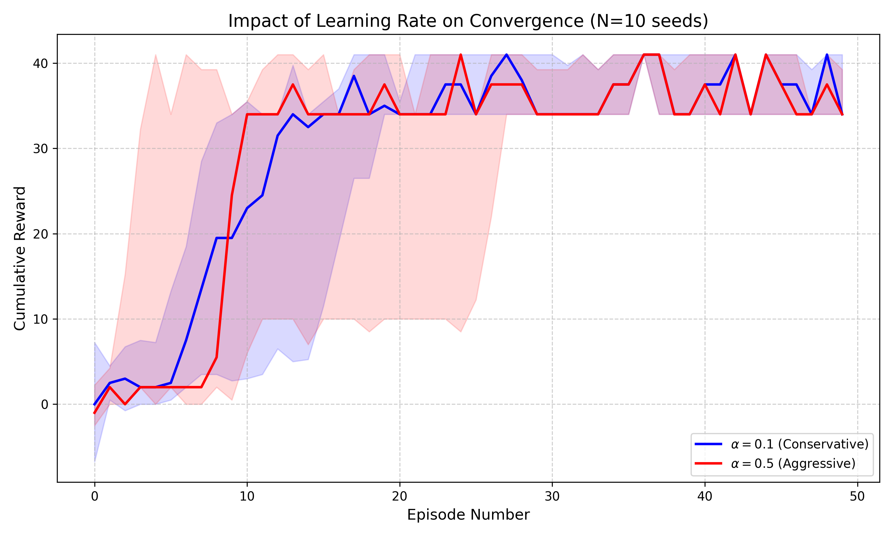

# OIST Brain Computation Guidebook - Implementations

Python implementations of the mathematical models from the **OIST Brain Computation Guidebook** (Neural Computation Unit).

## Project Overview
This repository serves as a self-study companion to understand the **computational mechanisms of the brain**, specifically focusing on:
* **Reinforcement Learning (RL):** How the brain learns from reward signals (Dopamine pathways).
* **Scientific Computing:** Implementing algorithms directly from mathematical models using Python.

##  Experimental Results: Learning Rate Sensitivity
In `Reinforcement.ipynb`, I implemented a Q-learning agent on the 'Pain-Gain' MDP to investigate the impact of the learning rate ($\alpha$) on policy convergence.

Following feedback from the **OIST Neural Computation Unit**, I validated the results over **10 random seeds** to ensure statistical significance.

### Observations
* **Aggressive Learning ($\alpha=0.5$, Red):** The agent achieves higher rewards significantly faster in the early episodes. However, the shaded regions (25th–75th percentiles) indicate **higher variance**, meaning the policy is less stable during the initial learning phase.
* **Conservative Learning ($\alpha=0.1$, Blue):** The agent learns slower but demonstrates **lower variance**, resulting in a more stable (monotonic) convergence trajectory.

## Contents
* `Reinforcement.ipynb`: Implementation of value iteration, policy iteration, and dopamine-based reward prediction error models.
* `convergence_benchmark.png`: Static visualization of the sensitivity analysis (Median + Quartiles).
